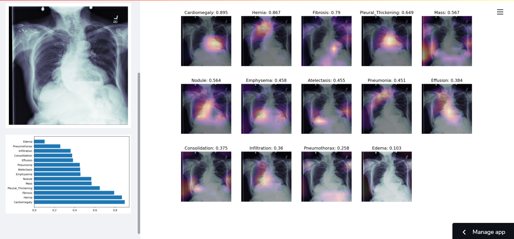

# Chest Xray Image Classification deployed on StreamLit

This is a demo of chest x-ray image classification using AI/ML models. A CNN is developed and trained on images of chest x-rays annotated with 14 classes of diseases. To provide some explainability, GradCAM is then used to show the features that the model bases its classifications. These are visualized as heatmaps on the classified images. The whole project is deployed using Streamlit
